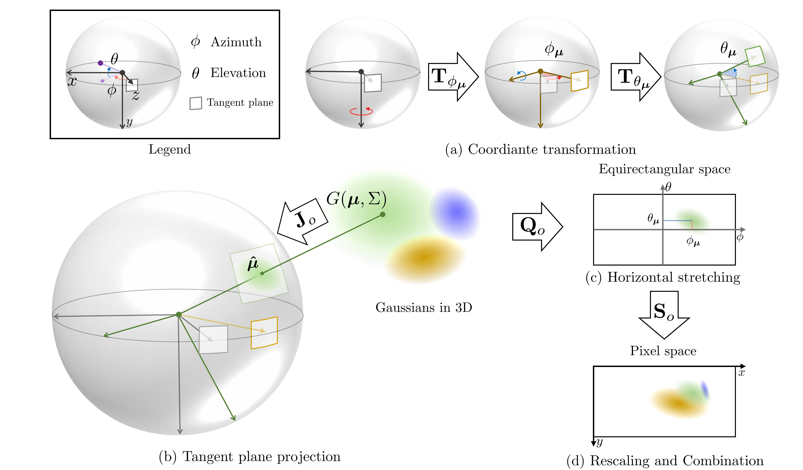
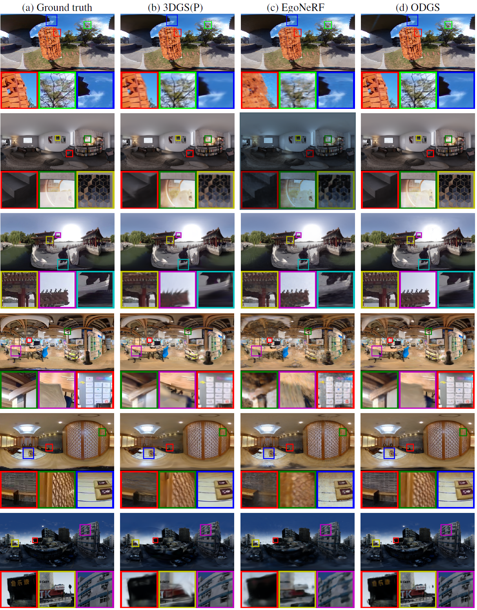

  <h1 align="center">ODGS: 3D Scene Reconstruction from Omnidirectional Images   with 3D Gaussian Splatting</h1>
  

    <a href="https://esw0116.github.io/">Suyoung Lee</a>*
    &nbsp;·&nbsp;
    <a href="https://robot0321.github.io/">Jaeyoung Chung</a>*
    &nbsp;·&nbsp;
    Jaeyoo Huh
    &nbsp;·&nbsp;
    <a href="https://cv.snu.ac.kr/index.php/~kmlee/">Kyoung Mu Lee</a>
     
    (* denotes equal contribution)
  

  <h3 align="center">NeurIPS 2024</h3>

<!-- 

 -->

    

---
This is an official implementation of ["ODGS: 3D Scene Reconstruction from Omnidirectional Images with 3D Gaussian Splatting."](https://arxiv.org/abs/2410.20686)

    

### Update Log
**24.12.08:**  First upload (CUDA rasterizer and training code)

## Installation
~~~bash
git clone https://github.com/esw0116/ODGS.git --recursive
cd ODGS

# Set Environment
conda env create --file environment.yml
conda activate ODGS
pip install submodules/simple-knn
pip install submodules/odgs-gaussian-rasterization
~~~

## Dataset
We evaluate 6 datasets by adjusting their resolutions and performing Structure-from-Motion using OpenMVG.  
For your convenience, we provide :star:[**links to the adjusted datasets**](https://drive.google.com/drive/folders/1xLdy0Zh6K1vAN_WpTWg4RTTUPxxv8RFp?usp=sharing):star: used in our paper.  
**Note**: The authors of 360Roam dataset do not want to distribute thier datasets yet (8 Dec. 2024), so we will not provide here. If you need, please contact them.

For reference, we provide the links to the **original datasets** here.  
[OmniBlender & Ricoh360](https://github.com/changwoonchoi/EgoNeRF) / [OmniPhotos](https://github.com/cr333/OmniPhotos?tab=readme-ov-file) / [360Roam](https://huajianup.github.io/research/360Roam/) / [OmniScenes](https://github.com/82magnolia/piccolo) / [360VO](https://huajianup.github.io/research/360VO/)  

## Training (Optimization)
ODGS requires optimization for each scene. Run the script below to start optimization:
~~~python
python train.py -s <source(dataset)_path> -m <output_path> --eval
~~~

<section class="section" id="BibTeX">
  

    <h2 class="title">Citation</h2>
    <pre><code>@article{lee2024odgs,
  title={ODGS: 3D Scene Reconstruction from Omnidirectional Images with 3D Gaussian Splattings},
  author={Lee, Suyoung and Chung, Jaeyoung and Huh, Jaeyoo and Lee, Kyoung Mu},
  journal={arXiv preprint arXiv:2410.20686},
  year={2024}
}</code></pre>
  

</section>

## Qualitative Comparisons

    

